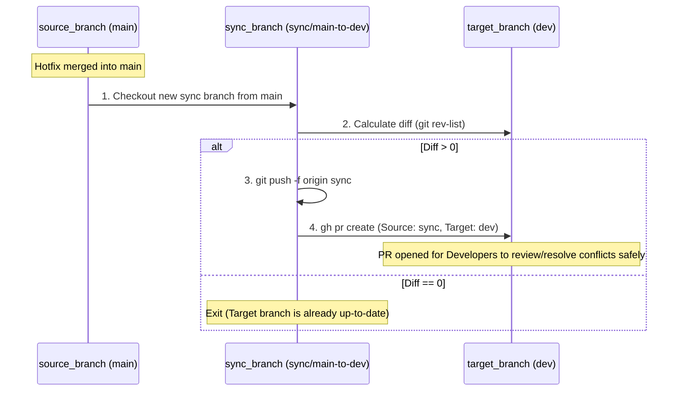

# Sync Branches Action

A GitHub Composite Action to automatically create a Pull Request that backports/syncs changes from a source branch to a target branch.

This is especially helpful in environments using GitFlow or multiple persistent branches (e.g., `dev` and `main`). When a hotfix is merged directly into `main`, this action can automatically open a PR to backport that hotfix into `dev`, ensuring your branches stay in sync and preventing regression bugs in future releases.

## Features
- **No force merges:** Creates a PR allowing developers to resolve any conflicts safely on the GitHub UI.
- **Smart detection:** Checks if there are actually differences. If `dev` already has all the code from `main`, it skips creating the PR.
- **Auto-updating:** If a PR is already open, it automatically force-pushes the newest changes to the sync branch without creating duplicate PRs.

## Workflow Diagram



## Usage

Create a workflow file (e.g., `.github/workflows/auto-sync.yml`) to trigger this action when a Pull Request is merged into your source branch (e.g., `main`).

```yaml
name: Auto Sync Branches

on:
  push:
    branches:
      - main

jobs:
  sync-main-to-dev:
    runs-on: ubuntu-latest
    steps:
      - name: Checkout Repository
        uses: actions/checkout@v6
        with:
          fetch-depth: 0 # Important: Need full history to compare branches

      - name: Sync Main to Dev
        uses: ./path-to-your-shared-repo/.github/actions/sync-branches
        with:
          source_branch: 'main'
          target_branch: 'dev'
          github_token: ${{ secrets.PAT_TOKEN }} # Or GITHUB_TOKEN if it has repo/pull_request permissions
```

### Inputs

| Input | Description | Required | Default |
|-------|-------------|----------|---------|
| `source_branch` | The branch containing the source source code (e.g., `main`). | **Yes** | N/A |
| `target_branch` | The branch that should receive the sync (e.g., `dev`). | **Yes** | N/A |
| `github_token` | GitHub token having permissions to read repo and create PRs. | **Yes** | N/A |
| `pr_title` | Title prefix of the generated PR. | No | `chore: sync changes` |
| `pr_body` | Body of the generated PR. | No | `Automated Pull Request to sync changes.` |
| `pr_labels` | Comma separated list of PR labels to attach. | No | `auto-sync, backport` |
| `auto_merge` | Set to `true` to enable auto-merge on the PR. | No | `false` |
| `merge_method` | Merge method if auto_merge is true (`merge`, `squash`, `rebase`). | No | `merge` |

### Outputs

| Output | Description |
|--------|-------------|
| `pull_request_url` | The URL of the created or updated Pull Request. |

## How it works

1. It configures a bot identity for Git operations.
2. It fetches the remote histories of `source_branch` and `target_branch`.
3. It counts the commits present in `source_branch` that are missing in `target_branch` using `git rev-list`. If the count is `0`, it safely exits.
4. It checks out a temporary branch: `sync/<source_branch>-to-<target_branch>` pointing at the latest `source_branch`.
5. It forcefully pushes this sync branch to the repository.
6. It uses the GitHub CLI (`gh pr create`) to open a Pull Request against `target_branch`. If one already exists, github automatically updates the PR view with the pushed commits.
