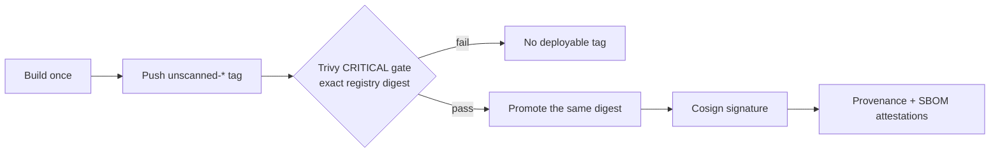

# duynhlab reusable workflows

Reusable GitHub Actions contracts for the duynhlab repositories. Version 2
implements a two-branch delivery model: pull requests target `dev` or `main`,
merges to `dev` create non-production images, and semantic tags from `main`
create production releases.

## Trust boundaries

| Boundary | Trigger | Result |
|----------|---------|--------|
| PR gate | PR into `dev` or `main` | Lint, tests, security analysis, SonarCloud, and a local image scan; nothing is published |
| Dev artifact | Push to `dev` | Immutable `sha-*` image for dev/staging |
| Production release | `vX.Y.Z` tag reachable from `main` | Versioned image and optional GoReleaser assets |

Published images follow one identity-preserving path:



## Public workflows

| Workflow | Use |
|----------|-----|
| [`check.yml`](.github/workflows/check.yml) | Complete Go PR gate |
| [`build.yml`](.github/workflows/build.yml) | Build and publish a `dev` image |
| [`release.yml`](.github/workflows/release.yml) | Clean production release from a tag |
| [`go-security.yml`](.github/workflows/go-security.yml) | Scheduled or standalone Go security scan |
| [`tf-lint.yml`](.github/workflows/tf-lint.yml) | OpenTofu/Terraform validation |
| [`status.yml`](.github/workflows/status.yml) | Optional status reporting |

`container-verify.yml`, `container-publish.yml`, and the individual Go/security
workflows are implementation primitives. Prefer the three public entrypoints.

## Minimal caller

```yaml
name: Check
on:
  pull_request:
    branches: [dev, main]

jobs:
  check:
    uses: duynhlab/gha-workflows/.github/workflows/check.yml@v2
    with:
      image-name: checkout-service
      sonar-project-key: duynhlab_checkout-service
      sonar-organization: duynhlab
    secrets:
      SONAR_TOKEN: ${{ secrets.SONAR_TOKEN }}
    permissions:
      actions: read
      contents: read
      pull-requests: read
      security-events: write
```

Production repositories should resolve `v2` and pin its immutable commit SHA.
See [`examples/`](examples/) for complete PR, dev, release, and branch-sync
callers.

## Documentation

- [Architecture](docs/architecture.md)
- [Workflow contract](docs/workflows.md)
- [Repository configuration](docs/configuration.md)
- [Go security policy](docs/go-security.md)
- [Troubleshooting](docs/troubleshooting.md)
