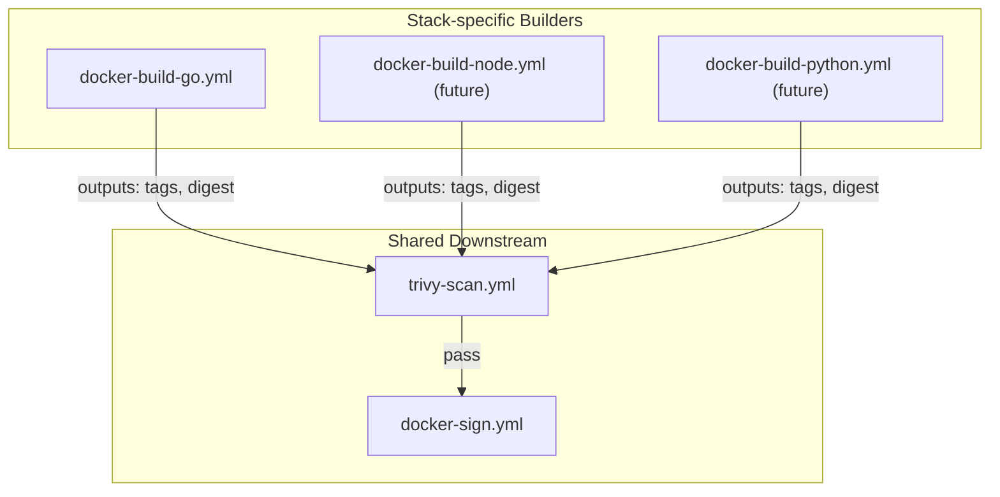
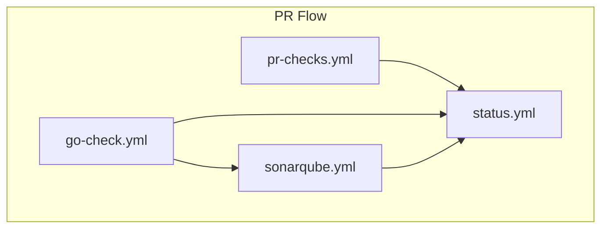
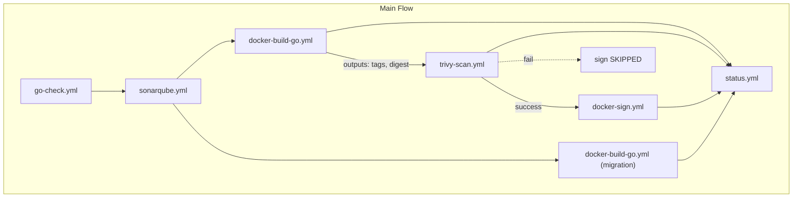

# Workflow Usage Guide

Detailed documentation for all available workflows with inputs, outputs, and examples.

---

## pr-checks.yml

**Purpose:** Pull request validation and notifications
**Trigger:** PR events only
**Features:** Branch validation (gitflow prefixes), CODEOWNERS tagging, Slack event notifications

### Inputs

| Parameter | Type | Default | Required | Description |
|-----------|------|---------|----------|-------------|
| `slack_channel_id` | string | - | **Yes** | Slack channel ID to post PR notifications (e.g. `C0AD82A9A74`) |
| `runs-on` | string | `"ubuntu-latest"` | No | Runner type |

### Outputs

| Output | Description |
|--------|-------------|
| `slack_thread_ts` | Slack thread timestamp for reply threading (pass to `status.yml`) |

### Secrets

| Secret | Required | Description |
|--------|----------|-------------|
| `SLACK_BOT_TOKEN` | **Yes** | Slack bot token for authentication |

### Usage

```yaml
jobs:
  pr-checks:
    if: github.event_name == 'pull_request'
    uses: duyhenryer/shared-workflows/.github/workflows/pr-checks.yml@main
    with:
      slack_channel_id: "C0AD82A9A74"
    secrets:
      SLACK_BOT_TOKEN: ${{ secrets.SLACK_BOT_TOKEN }}
```

---

## go-check.yml

**Purpose:** Go code quality assurance
**Trigger:** PR events
**Features:** Unit testing (with optional stable Go matrix), linting, coverage artifacts

### Inputs

| Parameter | Type | Default | Required | Description |
|-----------|------|---------|----------|-------------|
| `command-test` | string | - | **Yes** | Test command to execute |
| `setup-go` | boolean | `true` | No | Install Go automatically |
| `gomod-path` | string | `"go.mod"` | No | Path to go.mod file |
| `lint` | boolean | `false` | No | Enable linting |
| `lint-path` | string | `".golangci.yml"` | No | Lint config file path |
| `lint-timeout` | string | `"10m"` | No | Lint timeout duration |
| `lint-version` | string | `"v2.6.0"` | No | golangci-lint version |
| `test-stable` | boolean | `false` | No | Also test against stable Go version (non-blocking compatibility check) |
| `runs-on` | string | `"ubuntu-latest"` | No | Runner type |

### Usage

**Basic:**
```yaml
jobs:
  go-check:
    uses: duyhenryer/shared-workflows/.github/workflows/go-check.yml@main
    with:
      command-test: 'go test ./...'
    secrets: inherit
```

**With linting and stable Go matrix:**
```yaml
jobs:
  go-check:
    uses: duyhenryer/shared-workflows/.github/workflows/go-check.yml@main
    with:
      command-test: 'go test -race -coverprofile=coverage.out -covermode=atomic ./...'
      lint: true
      lint-version: 'v2.6.0'
      test-stable: true
    secrets: inherit
```

---

## docker-build-go.yml

**Purpose:** Build a Go service Docker image and push to GHCR
**Features:** Multi-platform builds, registry caching, provenance, SBOM, default tagging via `docker/metadata-action`

> This is the **Go-specific builder**. It outputs `tags` and `digest` that can be consumed by `trivy-scan.yml` and `docker-sign.yml`. For other stacks, create `docker-build-node.yml`, `docker-build-python.yml`, etc. with the same output interface.

### Inputs

| Parameter | Type | Default | Required | Description |
|-----------|------|---------|----------|-------------|
| `image-name` | string | - | **Yes** | Docker image name (without registry prefix) |
| `dockerfile` | string | `"Dockerfile"` | No | Path to Dockerfile |
| `context` | string | `"."` | No | Docker build context |
| `push` | boolean | `false` | No | Push image to registry |
| `platforms` | string | `"linux/amd64"` | No | Target platforms |
| `build-args` | string | `""` | No | Build-time variables |
| `tags` | string | `""` | No | Custom tags (comma-separated); empty = default tagging |
| `runs-on` | string | `"ubuntu-latest"` | No | Runner type |
| `sbom` | boolean | `false` | No | Generate SBOM attestation |

### Outputs

| Output | Description |
|--------|-------------|
| `tags` | Generated image tags (newline-separated) |
| `digest` | Image digest (`sha256:...`) |

### Usage

```yaml
jobs:
  build:
    uses: duyhenryer/shared-workflows/.github/workflows/docker-build-go.yml@main
    with:
      image-name: my-service
      push: true
    secrets: inherit
    permissions:
      contents: read
      packages: write
      actions: read
```

---

## docker-sign.yml

**Purpose:** Sign Docker images using Cosign (keyless / OIDC)
**Features:** Keyless signing via Sigstore OIDC, signs all tags for a given digest

> Chain after any builder workflow that outputs `tags` and `digest`. Typically placed after `trivy-scan.yml` so images are only signed after passing vulnerability checks.

### Inputs

| Parameter | Type | Default | Required | Description |
|-----------|------|---------|----------|-------------|
| `tags` | string | - | **Yes** | Image tags to sign (newline-separated, from `docker/metadata-action`) |
| `digest` | string | - | **Yes** | Image digest (`sha256:...`) |
| `runs-on` | string | `"ubuntu-latest"` | No | Runner type |

### Usage

```yaml
jobs:
  sign:
    needs: [build]
    uses: duyhenryer/shared-workflows/.github/workflows/docker-sign.yml@main
    with:
      tags: ${{ needs.build.outputs.tags }}
      digest: ${{ needs.build.outputs.digest }}
    secrets: inherit
    permissions:
      contents: read
      packages: write
      id-token: write
```

---

## trivy-scan.yml

**Purpose:** Docker image vulnerability scanning
**Features:** Trivy scanner, SARIF upload to GitHub Security tab, step summary, optional Google Sheets reporting, structured outputs

> Chain after any builder workflow (`docker-build-go.yml`, etc.) that pushes an image to GHCR. Place before `docker-sign.yml` to ensure only clean images are signed.

### Inputs

| Parameter | Type | Default | Required | Description |
|-----------|------|---------|----------|-------------|
| `image-ref` | string | - | **Yes** | Full image reference (e.g. `ghcr.io/org/app@sha256:...`) |
| `severity` | string | `"CRITICAL,HIGH"` | No | Comma-separated severity levels to scan |
| `exit-code` | string | `"1"` | No | `0` = warn only, `1` = fail on vulnerabilities |
| `ignore-unfixed` | boolean | `true` | No | Skip vulnerabilities without available fix |
| `scanners` | string | `"vuln"` | No | What to scan (`vuln`, `secret`, `misconfig`) |
| `runs-on` | string | `"ubuntu-latest"` | No | Runner type |
| `gsheet_spreadsheet_id` | string | `""` | No | Google Sheet ID for security scan reporting (tab: `security-scan`) |

### Outputs

| Output | Description |
|--------|-------------|
| `status` | `pass` or `fail` |
| `critical` | Count of CRITICAL vulnerabilities |
| `high` | Count of HIGH vulnerabilities |
| `medium` | Count of MEDIUM vulnerabilities |
| `low` | Count of LOW vulnerabilities |

### Secrets

| Secret | Required | Description |
|--------|----------|-------------|
| `GSHEET_CLIENT_EMAIL` | No | Google service account email (for Sheets reporting) |
| `GSHEET_PRIVATE_KEY` | No | Google service account private key (for Sheets reporting) |

### Usage

**Standalone (after a custom build):**
```yaml
jobs:
  build:
    # ... your build job that outputs tags and digest ...

  scan:
    needs: [build]
    uses: duyhenryer/shared-workflows/.github/workflows/trivy-scan.yml@main
    with:
      image-ref: ghcr.io/${{ github.repository }}/my-app@${{ needs.build.outputs.digest }}
      severity: 'CRITICAL,HIGH'
      exit-code: '1'
    secrets: inherit
    permissions:
      contents: read
      packages: read
      security-events: write
```

**With Google Sheets reporting:**
```yaml
jobs:
  scan:
    uses: duyhenryer/shared-workflows/.github/workflows/trivy-scan.yml@main
    with:
      image-ref: ghcr.io/${{ github.repository }}/my-app@sha256:abc123...
      gsheet_spreadsheet_id: "1AbC...xYz"
    secrets:
      GSHEET_CLIENT_EMAIL: ${{ secrets.GSHEET_CLIENT_EMAIL }}
      GSHEET_PRIVATE_KEY: ${{ secrets.GSHEET_PRIVATE_KEY }}
    permissions:
      contents: read
      packages: read
      security-events: write
```

> When using Google Sheets, create a tab named `security-scan` in your spreadsheet. Each scan appends a row with: Timestamp, Workflow URL, Repository, Image, Critical, High, Medium, Low, Status, Branch, Author.

---

## sonarqube.yml

**Purpose:** SonarCloud code analysis
**Features:** Go coverage integration, Quality Gate check, configurable exclusions

### Inputs

| Parameter | Type | Default | Required | Description |
|-----------|------|---------|----------|-------------|
| `project-key` | string | - | **Yes** | SonarCloud project key (e.g. `org_project-name`) |
| `organization` | string | - | **Yes** | SonarCloud organization |
| `sources` | string | `"."` | No | Comma-separated source directories |
| `exclusions` | string | `"**/vendor/**,**/node_modules/**,**/*_test.go,**/testdata/**"` | No | Comma-separated exclude patterns |
| `go-version` | string | `"1.25"` | No | Go version to use |
| `coverage-path` | string | `"coverage.out"` | No | Path to Go coverage file |
| `artifact-name` | string | `"coverage-report"` | No | Artifact name containing coverage report |
| `runs-on` | string | `"ubuntu-latest"` | No | Runner type |
| `quality-gate-wait` | boolean | `true` | No | Wait for Quality Gate result |
| `quality-gate-timeout` | number | `300` | No | Quality Gate polling timeout (seconds) |
| `fail-on-quality-gate` | boolean | `true` | No | Fail the job if Quality Gate fails |

### Secrets

| Secret | Required | Description |
|--------|----------|-------------|
| `SONAR_TOKEN` | **Yes** | SonarCloud authentication token |

### Usage

```yaml
jobs:
  go-check:
    uses: duyhenryer/shared-workflows/.github/workflows/go-check.yml@main
    with:
      command-test: 'go test -race -coverprofile=coverage.out -covermode=atomic ./...'
    secrets: inherit

  sonar:
    needs: [go-check]
    uses: duyhenryer/shared-workflows/.github/workflows/sonarqube.yml@main
    with:
      project-key: my-org_my-project
      organization: my-org
    secrets:
      SONAR_TOKEN: ${{ secrets.SONAR_TOKEN }}
```

---

## tf-lint.yml

**Purpose:** Terraform validation and linting
**Features:** `terraform fmt` check, TFLint analysis with plugin caching

### Inputs

| Parameter | Type | Default | Required | Description |
|-----------|------|---------|----------|-------------|
| `tflint_config_path` | string | - | No | Custom path to `.tflint.hcl` config |
| `tflint_minimum_failure_severity` | string | `"warning"` | No | Minimum severity to cause failure |
| `tflint_force` | boolean | `false` | No | Force TFLint to return exit code 0 |

### Usage

```yaml
jobs:
  terraform-check:
    uses: duyhenryer/shared-workflows/.github/workflows/tf-lint.yml@main
    with:
      tflint_minimum_failure_severity: 'error'
```

---

## status.yml

**Purpose:** CI status reporting and notifications
**Features:** Workflow/job status aggregation, Slack notifications (with thread support), Google Sheets reporting, job summary table

### Inputs

| Parameter | Type | Default | Required | Description |
|-----------|------|---------|----------|-------------|
| `runs-on` | string | `"ubuntu-latest"` | No | Runner type |
| `slack_msg` | string | *(auto-generated)* | No | Custom Slack message |
| `slack_channel_id` | string | `""` | No | Slack channel ID for notifications |
| `slack_thread_ts` | string | `""` | No | Slack thread timestamp (from `pr-checks.yml` output) for reply threading |
| `gsheet_spreadsheet_id` | string | `""` | No | Google Sheet spreadsheet ID for CI reporting |

### Secrets

| Secret | Required | Description |
|--------|----------|-------------|
| `SLACK_BOT_TOKEN` | **Yes** | Slack bot token for notifications |
| `GSHEET_CLIENT_EMAIL` | No | Google service account email for Sheets API |
| `GSHEET_PRIVATE_KEY` | No | Google service account private key for Sheets API |

### Usage

**Basic (Slack only):**
```yaml
jobs:
  notify:
    needs: [build, test]
    if: always()
    uses: duyhenryer/shared-workflows/.github/workflows/status.yml@main
    with:
      slack_channel_id: "C0AD82A9A74"
    secrets:
      SLACK_BOT_TOKEN: ${{ secrets.SLACK_BOT_TOKEN }}
```

**With PR thread and Google Sheets:**
```yaml
jobs:
  pr-checks:
    if: github.event_name == 'pull_request'
    uses: duyhenryer/shared-workflows/.github/workflows/pr-checks.yml@main
    with:
      slack_channel_id: "C0AD82A9A74"
    secrets:
      SLACK_BOT_TOKEN: ${{ secrets.SLACK_BOT_TOKEN }}

  # ... other jobs ...

  notify:
    needs: [pr-checks, build, test]
    if: always()
    uses: duyhenryer/shared-workflows/.github/workflows/status.yml@main
    with:
      slack_channel_id: "C0AD82A9A74"
      slack_thread_ts: ${{ needs.pr-checks.outputs.slack_thread_ts }}
      gsheet_spreadsheet_id: "1AbC...xYz"
    secrets:
      SLACK_BOT_TOKEN: ${{ secrets.SLACK_BOT_TOKEN }}
      GSHEET_CLIENT_EMAIL: ${{ secrets.GSHEET_CLIENT_EMAIL }}
      GSHEET_PRIVATE_KEY: ${{ secrets.GSHEET_PRIVATE_KEY }}
```

---

## Composite Action: slack-ci-notification

**Location:** `.github/actions/slack-ci-notification/action.yml`
**Purpose:** Send CI status notification to Slack with thread support
**Used by:** `status.yml` workflow internally

- If `thread_ts` is empty: sends a standalone CI status message (push-to-main flow).
- If `thread_ts` is provided: replies in that Slack thread (PR flow).

### Inputs

| Parameter | Required | Description |
|-----------|----------|-------------|
| `channel_id` | **Yes** | Slack channel ID |
| `status` | **Yes** | CI status: `success`, `failed`, `cancelled` |
| `thread_ts` | No | Slack thread timestamp to reply to |
| `slack_bot_token` | **Yes** | Slack bot token |

### Outputs

| Output | Description |
|--------|-------------|
| `ts` | Timestamp of sent message |

> This action is used internally by `status.yml`. You do not need to call it directly unless building custom notification workflows.

---

## Architecture

The `docker-build-go.yml` is the **Go-specific builder**. Future stacks (`docker-build-node.yml`, `docker-build-python.yml`, etc.) follow the same output interface (`tags` + `digest`), sharing the downstream scan and sign workflows:



### CI Flow: Pull Request

On PR branches: only code quality and notifications. Docker jobs are **skipped** (`if: github.ref == 'refs/heads/main'`).



### CI Flow: Push to main (merged)

Full pipeline on main: build -> scan -> sign. If scan fails, sign is automatically skipped.



---

## Complete Examples

### Go Project Pipeline

```yaml
name: CI Pipeline

on:
  push:
    branches: [main, dev]
  pull_request:
    branches: [main, dev]

jobs:
  # PR Validation
  pr-checks:
    if: github.event_name == 'pull_request'
    uses: duyhenryer/shared-workflows/.github/workflows/pr-checks.yml@main
    with:
      slack_channel_id: "C0AD82A9A74"
    secrets:
      SLACK_BOT_TOKEN: ${{ secrets.SLACK_BOT_TOKEN }}

  # Go quality checks
  go-check:
    uses: duyhenryer/shared-workflows/.github/workflows/go-check.yml@main
    with:
      command-test: 'go test -race -coverprofile=coverage.out -covermode=atomic ./...'
      lint: true
    secrets: inherit

  # SonarCloud analysis
  sonar:
    needs: [go-check]
    uses: duyhenryer/shared-workflows/.github/workflows/sonarqube.yml@main
    with:
      project-key: my-org_my-project
      organization: my-org
    secrets:
      SONAR_TOKEN: ${{ secrets.SONAR_TOKEN }}

  # Notify status
  notify:
    needs: [pr-checks, go-check, sonar]
    if: always()
    uses: duyhenryer/shared-workflows/.github/workflows/status.yml@main
    with:
      slack_channel_id: "C0AD82A9A74"
      slack_thread_ts: ${{ needs.pr-checks.outputs.slack_thread_ts }}
    secrets:
      SLACK_BOT_TOKEN: ${{ secrets.SLACK_BOT_TOKEN }}
```

### Docker Build Pipeline (build -> scan -> sign)

Service repos chain the individual workflows explicitly. Each job passes outputs to the next via `needs`:

```yaml
name: Docker Build

on:
  push:
    branches: [main]
    tags: ['v*']

permissions:
  contents: read
  packages: write
  id-token: write
  actions: read
  security-events: write

jobs:
  # Step 1: Build & push
  build:
    uses: duyhenryer/shared-workflows/.github/workflows/docker-build-go.yml@main
    with:
      image-name: my-service
      push: true
    secrets: inherit
    permissions:
      contents: read
      packages: write
      actions: read

  # Step 2: Vulnerability scan (uses digest from build)
  scan:
    needs: [build]
    uses: duyhenryer/shared-workflows/.github/workflows/trivy-scan.yml@main
    with:
      image-ref: ghcr.io/${{ github.repository }}/my-service@${{ needs.build.outputs.digest }}
      severity: 'CRITICAL,HIGH'
      exit-code: '1'
      ignore-unfixed: true
    secrets: inherit
    permissions:
      contents: read
      packages: read
      security-events: write

  # Step 3: Sign (uses tags + digest from build; auto-skipped if scan fails)
  sign:
    needs: [build, scan]
    uses: duyhenryer/shared-workflows/.github/workflows/docker-sign.yml@main
    with:
      tags: ${{ needs.build.outputs.tags }}
      digest: ${{ needs.build.outputs.digest }}
    secrets: inherit
    permissions:
      contents: read
      packages: write
      id-token: write

  notify:
    needs: [build, scan, sign]
    if: always()
    uses: duyhenryer/shared-workflows/.github/workflows/status.yml@main
    with:
      slack_channel_id: "C0AD82A9A74"
    secrets:
      SLACK_BOT_TOKEN: ${{ secrets.SLACK_BOT_TOKEN }}
```

> **How it works:** `sign` depends on both `build` and `scan`. If `scan` fails, GitHub automatically skips `sign` -- no `if:` condition needed. To scan without blocking sign, set `exit-code: '0'`.

---

## Configuration

### Required Secrets

Set these in your repository settings (Settings → Secrets and variables → Actions):

| Secret | Used By | Required | Description |
|--------|---------|----------|-------------|
| `SLACK_BOT_TOKEN` | pr-checks.yml, status.yml | **Yes** | Slack bot token for notifications |
| `SONAR_TOKEN` | sonarqube.yml | **Yes** | SonarCloud authentication token |
| `GSHEET_CLIENT_EMAIL` | status.yml, trivy-scan.yml | No | Google service account email |
| `GSHEET_PRIVATE_KEY` | status.yml, trivy-scan.yml | No | Google service account private key |

### Repository Setup

1. **Create `.github/CODEOWNERS` file:**
```gitignore
# Global owners
* @duyhenryer @team-lead

# Language-specific
*.go @team-backend
*.tf @team-infra

# Directory-specific
/cmd @team-backend
/terraform @team-infra
```

2. **Configure Slack channels** (optional):
   - `#ci-alert` - General CI notifications
   - `#pull-request-main` - PR notifications for main branch
   - `#pull-request-dev` - PR notifications for dev branch
   - `#dev-notifications` - Development updates

---

## Troubleshooting

### "SLACK_BOT_TOKEN not found"

**Solution:** Add the secret in repository settings:
1. Go to Settings → Secrets and variables → Actions
2. Click "New repository secret"
3. Name: `SLACK_BOT_TOKEN`
4. Value: Your Slack bot token

### "Branch validation failed"

**Solution:** Use correct branch naming:
- `hotfix/critical-bug`
- `release/v1.2.3`
- `fix-something` (not allowed -- use `fix/something` instead)

### "CODEOWNERS not found"

**Solution:** Create `.github/CODEOWNERS` file in your repository root.

### "Lint timeout exceeded"

**Solution:** Increase timeout in workflow:
```yaml
with:
  lint-timeout: '20m'  # Increase from default 10m
```

### "TFLint config not found"

**Solution:** Either:
1. Create a `.tflint.hcl` file, or
2. Specify custom path:
```yaml
with:
  tflint_config_path: 'terraform/.tflint.hcl'
```

### "SonarCloud Quality Gate failed"

**Solution:** Either fix the issues reported by SonarCloud, or temporarily disable failure:
```yaml
with:
  fail-on-quality-gate: false
```

### "Trivy scan blocking image signing"

**Solution:** If you want to scan without blocking the sign phase, set `exit-code` to `'0'` in your `trivy-scan.yml` call:
```yaml
  scan:
    needs: [build]
    uses: duyhenryer/shared-workflows/.github/workflows/trivy-scan.yml@main
    with:
      image-ref: ghcr.io/${{ github.repository }}/my-service@${{ needs.build.outputs.digest }}
      exit-code: '0'  # Warn only, don't block signing
```

Or to skip scanning entirely, simply remove the `scan` job and have `sign` depend only on `build`.

---

## Additional Resources

- [GitHub Actions Documentation](https://docs.github.com/en/actions)
- [Go Testing](https://golang.org/doc/code.html#Testing)
- [TFLint Documentation](https://github.com/terraform-linters/tflint)
- [SonarCloud Documentation](https://docs.sonarsource.com/sonarcloud/)
- [Cosign Documentation](https://docs.sigstore.dev/cosign/overview/)
- [Trivy Documentation](https://trivy.dev/latest/docs/)
- [Slack API](https://api.slack.com/)

---

<div align="center">

**Need help?** [Open an issue](https://github.com/duyhenryer/shared-workflows/issues)

[Back to Top](#workflow-usage-guide)

</div>
