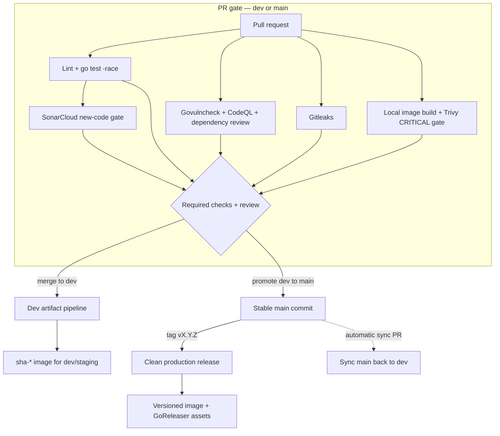
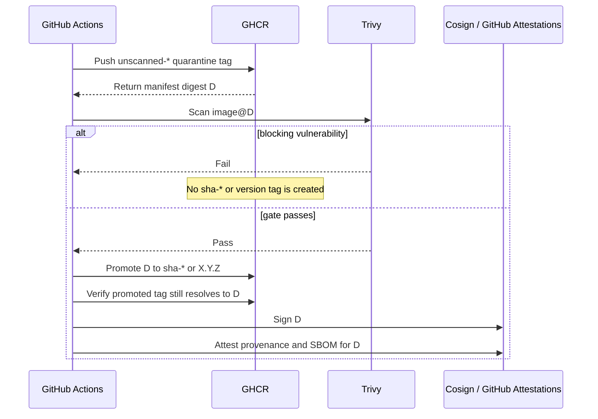

# CI/CD architecture

The workflow set separates source validation from trusted artifact creation.
The same commit is checked again whenever its trust level increases.

## Delivery flow

PR jobs have read-only repository permissions and cannot publish packages,
request OIDC tokens, sign images, or create attestations.

## Image identity

The former implementation built an amd64 image for scanning and then rebuilt a
multi-platform image for pushing. Those two builds could have different
digests. Version 2 builds a publishable image exactly once.

Quarantine tags are intentionally visible in GHCR but are not deployable. Image
automation and admission policy must exclude `unscanned-*`.

## Branch ownership

| Change | Source | Target | Artifact behavior |
|--------|--------|--------|-------------------|
| Feature or fix | `feature/*`, `fix/*`, approved prefixes | `dev` | PR verification only |
| Promotion | `dev` | `main` | PR verification only |
| Hotfix | `hotfix/*` from `main` | `main` | PR verification, then release tag |
| Back-sync | `main` via `sync/main-to-dev` | `dev` | Required checks before auto-merge |

An untagged `main` commit does not publish a container. Production publication
starts only from a reviewed semantic tag whose commit is reachable from `main`.

## Continuous controls

- Dependabot updates GitHub Actions and supported dependency manifests.
- Scheduled `go-security.yml` calls re-scan source dependencies.
- Registry re-scanning and OpenSSF Scorecard/OSV are follow-up controls.
- Cluster admission verification is a separate Audit-to-Enforce rollout; CI
  already emits the Cosign signature, build provenance, and SBOM it will need.
