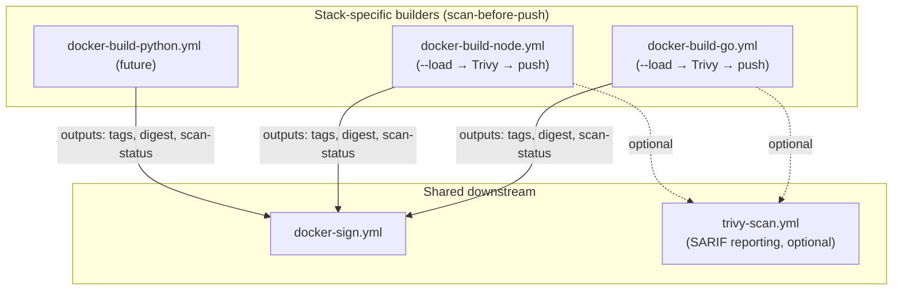
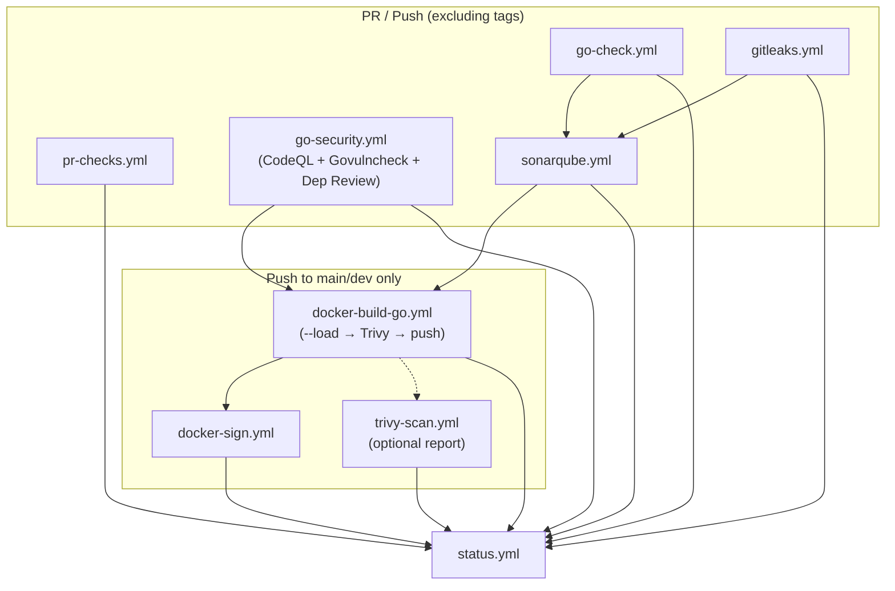
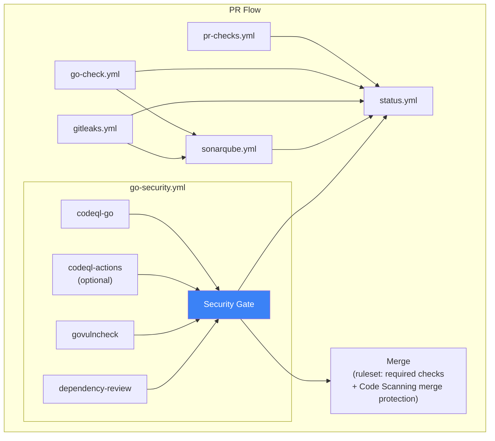
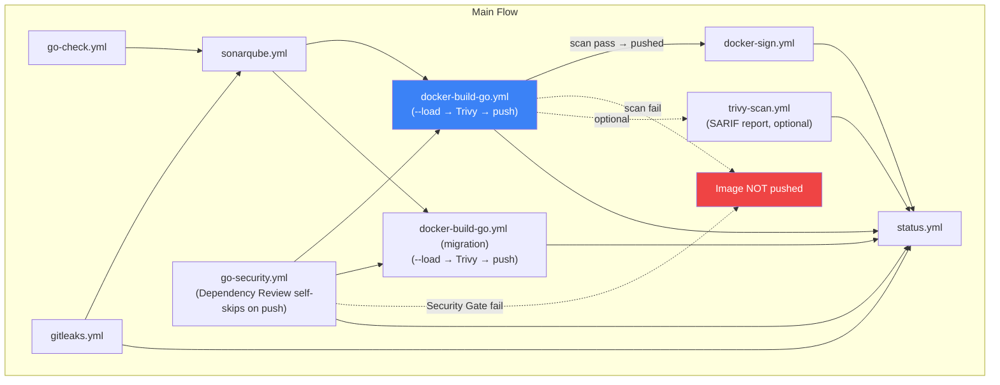
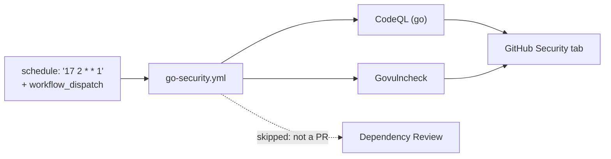

# Architecture

How the reusable workflows in this repository fit together. This is the single source for
repository-level pipeline diagrams — per-example diagrams live in
[../examples/README.md](../examples/README.md).

- Workflow inputs and outputs — [workflows.md](workflows.md)
- Security policy and rollout — [go-security.md](go-security.md)

## Builder interface

`docker-build-go.yml` is the Go-specific builder with integrated Trivy scanning. Other stacks
(`docker-build-node.yml`, and any future `docker-build-python.yml`) implement the **same output
interface** — `tags` + `digest` + `scan-status` — so they share the downstream sign and report
workflows.

The builders differ in tagging: the Go builder emits **immutable tags only**, the Node builder
also publishes `:latest` and branch tags. See
[workflows.md — Container images](workflows.md#container-images).

## Overall CI flow

Canonical high-level flow with scan-before-push.

> `go-security.yml` runs **in parallel** with `go-check` / `gitleaks` / `sonarqube` — it is not
> chained behind Sonar, which would add its full duration to the PR critical path. But
> `docker-build` waits for it, so a blocking Govulncheck finding prevents the image from ever
> being pushed.

## Pull request

Code quality, secret scanning and security scanning run in parallel. Docker jobs are skipped.

Required status checks to configure on `main`: `go-check / Test`, `gitleaks / Gitleaks Scan`,
`go-security / Security Gate`, the SonarCloud Quality Gate, plus a Code Scanning merge
protection rule for CodeQL alerts. Do **not** require `notify`.

## Push to main

Full pipeline: build with integrated scan, then sign. If the pre-push scan fails the image is
never pushed and signing is skipped automatically.

> Because `docker-build` waits for `go-security`, a Govulncheck gate failure means no new image
> reaches GHCR — so Flux never sees a deployable tag. This is a source and dependency gate; the
> final-image Trivy gate, SBOM and Cosign remain a separate supply-chain layer.

## Scheduled security scan

Weekly source and dependency re-scan, decoupled from the build so it can never push an image or
trigger a deployment.

Use a weekly cron with a staggered minute (17 / 29 / 41) across repository groups — a daily
`0 2 * * *` across dozens of services creates a thundering herd on the runners.
