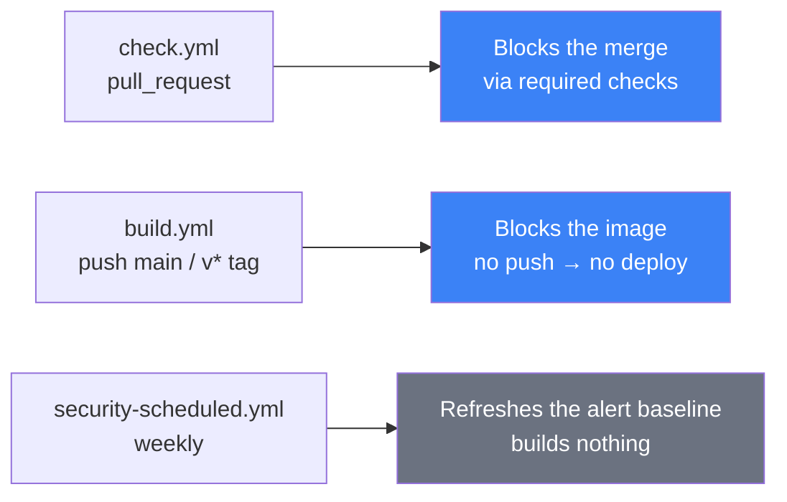
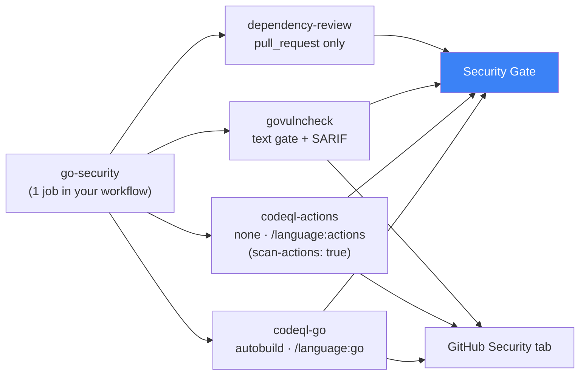
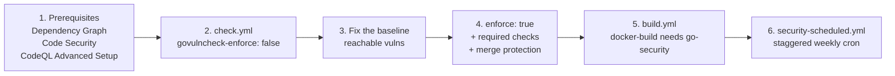

# Example Caller Workflows for a Go Service

Copy-paste starting points for onboarding a Go microservice onto the shared security stack.
Each file is a **caller** that lives in the service repository; the scanners themselves live in
this repository.

| Example | Copy to | Trigger |
|---------|---------|---------|
| [go-service-check.yml](go-service-check.yml) | `.github/workflows/check.yml` | `pull_request` |
| [go-service-build.yml](go-service-build.yml) | `.github/workflows/build.yml` | `push` to `main`, `v*` tags |
| [go-service-security-scheduled.yml](go-service-security-scheduled.yml) | `.github/workflows/security-scheduled.yml` | weekly `schedule` + `workflow_dispatch` |

Before copying, replace: `project-key`, `organization`, `image-name`, and `slack_channel_id`.

- Inputs and outputs — [../docs/workflows.md](../docs/workflows.md)
- Full pipeline diagrams — [../docs/architecture.md](../docs/architecture.md)
- Policy, rollout and exceptions — [../docs/go-security.md](../docs/go-security.md)

---

## How the three files divide the work



The schedule is a separate file on purpose: a scheduled run must never build or push an image,
because that would let a deployment happen with nobody watching.

---

## What one `go-security` call expands into

A single job in your caller fans out into four scanners and one gate:



Check names that appear on the PR — require the gate, not the individual scanners:

```text
go-security / Security Gate
go-security / codeql-go / Analyze (go)
go-security / govulncheck / Govulncheck
go-security / dependency-review / Dependency Review
```

The ruleset is what actually blocks the merge:

| Required check | Source |
|----------------|--------|
| `go-check / Test` | `go-check.yml` |
| `gitleaks / Gitleaks Scan` | `gitleaks.yml` |
| `go-security / Security Gate` | `go-security.yml` |
| SonarCloud Quality Gate | SonarCloud app |
| Code Scanning merge protection (High+) | CodeQL alerts, **not** the job status |

---

## Notes on the examples

**`check.yml`** — `go-security` runs in parallel with `go-check` / `gitleaks` / `sonar`. It is
intentionally **not** chained behind `sonar`, which would add its full duration to the PR
critical path. `notify` includes `go-security` in its `needs`, but must never be a required
check.

**`build.yml`** — `docker-build` and `release-binary` list their dependencies explicitly
(`needs: [go-check, gitleaks, sonar, go-security]`) rather than inheriting `gitleaks` through
the `sonar` edge, so the gate graph is auditable at a glance. Dependency Review self-skips on a
push, and the Security Gate accounts for that.

> **Watch out:** a *skipped* `needs` dependency skips every downstream job. That is why the
> build example does **not** exclude tags from `gitleaks` — doing so would silently turn a tag
> build into a no-op.

**`security-scheduled.yml`** — `permissions: {}` at the top level, granted back only on the job.
Stagger the cron minute across repository groups (17 / 29 / 41); a daily `0 2 * * *` on dozens
of services is a thundering herd on the runner pool.

---

## Onboarding order



Start with `govulncheck-enforce: false`. Turning enforcement on before the existing reachable
findings are fixed turns every PR red at once, and govulncheck has no stable per-finding ignore
mechanism to escape with. Keep `allowed-licenses` empty until Legal approves a policy — empty
skips the license check rather than enforcing someone else's allowlist.
