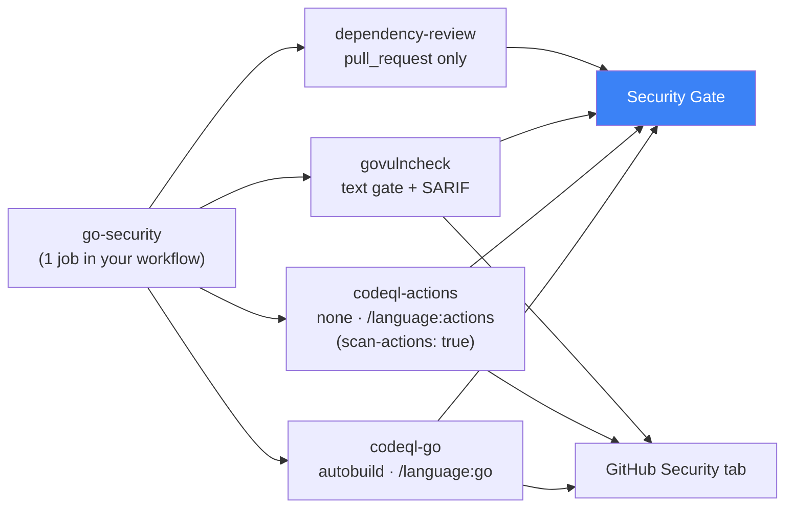
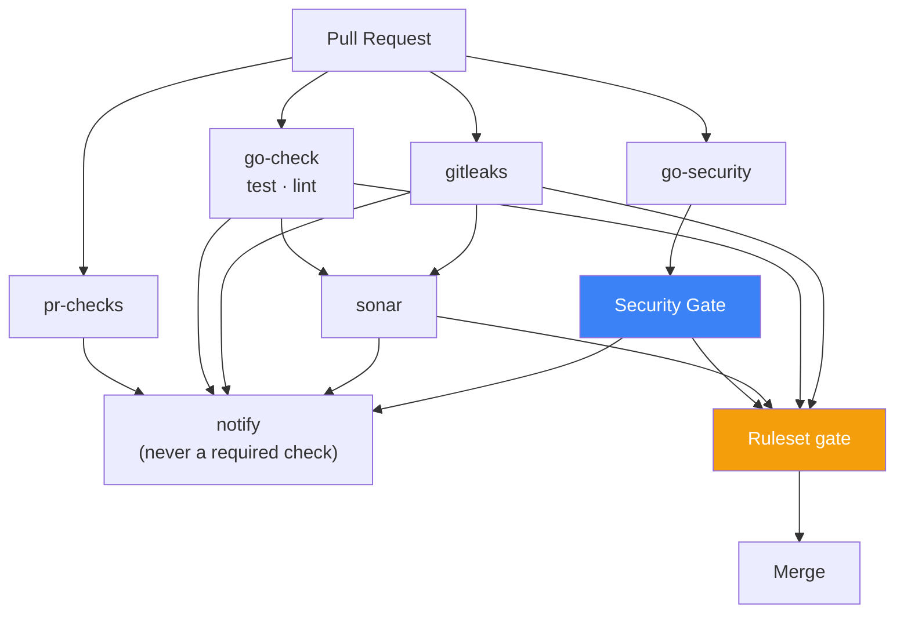
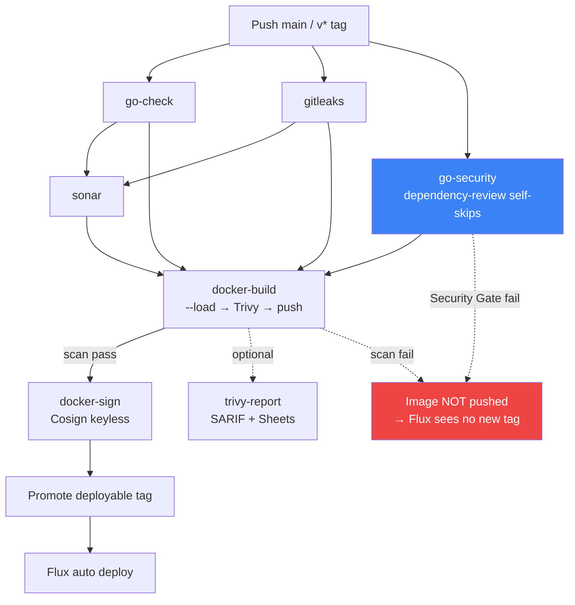
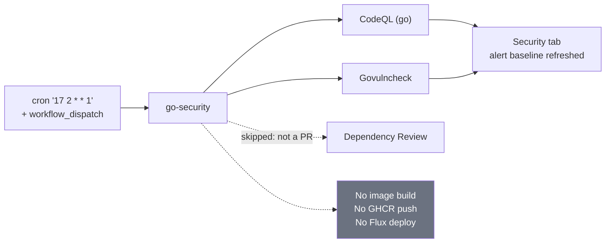
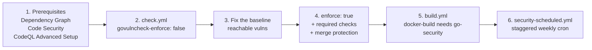

# Example Caller Workflows for a Go Service

Copy-paste starting points for onboarding a Go microservice onto the shared security stack.
Each file is a **caller** that lives in the service repository; the scanners themselves live in
this repository.

| Example | Copy to | Trigger |
|---------|---------|---------|
| [go-service-check.yml](go-service-check.yml) | `.github/workflows/check.yml` | `pull_request` |
| [go-service-build.yml](go-service-build.yml) | `.github/workflows/build.yml` | `push` to `main`, `v*` tags |
| [go-service-security-scheduled.yml](go-service-security-scheduled.yml) | `.github/workflows/security-scheduled.yml` | weekly `schedule` + `workflow_dispatch` |

Before copying, replace: `project-key`, `organization`, `image-name`, and `slack_channel_id`.

Contract and policy details: [../docs/go-security.md](../docs/go-security.md).
Inputs and outputs: [../USAGE.md](../USAGE.md).

---

## What one `go-security` call expands into

A single job in your caller fans out into four scanners and one gate:



Check names that appear on the PR (require the gate, not the individual scanners):

```text
go-security / Security Gate
go-security / codeql-go / Analyze (go)
go-security / govulncheck / Govulncheck
go-security / dependency-review / Dependency Review
```

---

## After applying `check.yml` (pull request)



`go-security` runs in parallel with everything else — it is intentionally **not** chained behind
`sonar`, which would add its full duration to the PR critical path.

The ruleset gate is what actually blocks the merge:

| Required check | Source |
|----------------|--------|
| `go-check / Test` | `go-check.yml` |
| `gitleaks / Gitleaks Scan` | `gitleaks.yml` |
| `go-security / Security Gate` | `go-security.yml` |
| SonarCloud Quality Gate | SonarCloud app |
| Code Scanning merge protection (High+) | CodeQL alerts, **not** the job status |

---

## After applying `build.yml` (push to main)



`docker-build` and `release-binary` list their dependencies explicitly
(`needs: [go-check, gitleaks, sonar, go-security]`) rather than inheriting `gitleaks` through the
`sonar` edge, so the gate graph is auditable at a glance.

> **Watch out:** a *skipped* `needs` dependency skips every downstream job. That is why the
> build example does **not** exclude tags from `gitleaks` — doing so would silently turn a tag
> build into a no-op.

---

## After applying `security-scheduled.yml` (weekly)



The schedule lives in its own file, never in `build.yml`, precisely so a scheduled run cannot
push an image or trigger a deployment.

---

## Onboarding order



Start with `govulncheck-enforce: false`. Turning enforcement on before the existing reachable
findings are fixed turns every PR red at once, and govulncheck has no stable per-finding ignore
mechanism to escape with. Keep `allowed-licenses` empty until Legal approves a policy — empty
skips the license check rather than enforcing someone else's allowlist.
