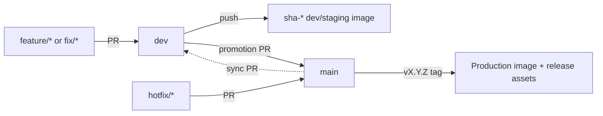

# Go service callers

Copy each example into the matching service repository. The examples use `@v2`
for readability; production callers resolve the tag and pin its commit SHA.

| Example | Destination | Trigger |
|---------|-------------|---------|
| [go-service-check.yml](go-service-check.yml) | `.github/workflows/check.yml` | PR into `dev` or `main` |
| [go-service-build.yml](go-service-build.yml) | `.github/workflows/build.yml` | Push to `dev` |
| [go-service-release.yml](go-service-release.yml) | `.github/workflows/release.yml` | `vX.Y.Z` tag |
| [go-service-security-scheduled.yml](go-service-security-scheduled.yml) | `.github/workflows/security-scheduled.yml` | Weekly/manual |
| [sync-main-to-dev.yml](sync-main-to-dev.yml) | `.github/workflows/sync-main-to-dev.yml` | Push to `main` |

Replace `image-name`, SonarCloud identifiers, and the workflow/action ref. Add
`SONAR_TOKEN`; add `SYNC_BRANCH_TOKEN` only for automatic back-sync.

The scheduled security caller intentionally has no image job. A scheduled scan
must not create a deployment candidate.
